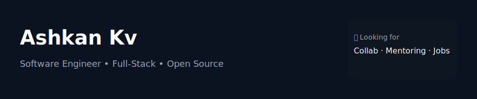

# 👋 سلام، من اشکانم

**Full-Stack Developer | Software Engineer | Open Source Enthusiast**

به دنیای من در GitHub خوش اومدی!  
من عاشق ساختن ابزارهای کاربردی، یادگیری تکنولوژی‌های جدید و همکاری در پروژه‌های متن‌باز هستم.

---

## 🚀 مهارت‌ها و تکنولوژی‌ها

**Frontend:**  
React.js, Next.js, TailwindCSS, HTML5, CSS3, JavaScript (ES6+)

**Backend:**  
Node.js, Express, REST API, Authentication, JWT

**Databases:**  
MongoDB, PostgreSQL

**Tools:**  
Git, GitHub, Docker, Linux, Vercel, Notion

---

## 📊 آمار GitHub

---

## 🔥 پروژه‌های پیشنهادی

- [Project 1](#) — توضیح کوتاه درباره پروژه  
- [Project 2](#) — توضیح کوتاه  
- [Project 3](#) — توضیح کوتاه  

(وقتی خواستی پروژه‌هات رو معرفی کنیم فقط اسمشون رو بده تا کاملش کنم)

---

## 📫 راه‌های ارتباطی

- ایمیل: **mail@ashkankashef.ir**
- لینکدین: [Profile](https://linkedin.com)  
- وبسایت/رزومه: *(https://ashkankashef.ir/)*

---

## 🤝 همکاری

اگر دوست داری روی پروژه‌ای با هم کار کنیم یا ایده‌ای داری، خوشحال میشم پیام بدی.

